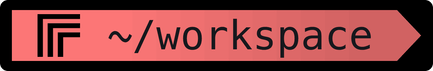
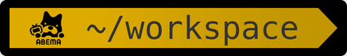

# oh-my-terminal

회사 브랜드 색과 로고를 iTerm2 터미널에 입히는 zsh 플러그인입니다. iTerm2에서 회사 프로필을
고르면 어느 폴더에서나 그 회사 테마가 나오고, 명령을 치는 동안에는 히스토리에서 찾은 나머지를
흐리게 제안합니다.


## 왜 만들었나

여러 회사의 프로젝트를 한 컴퓨터에서 오가다 보면 터미널 창이 전부 똑같이 생겨서, 지금 이 창이
어느 회사 작업인지 경로를 읽어야 압니다. 창마다 그 회사의 색과 로고가 보이면 한눈에 구분됩니다.

처음에는 폴더 경로(`~/Desktop/kakao`면 카카오)로 회사를 골랐습니다. 그런데 배경·폰트는 iTerm2
프로필이, 프롬프트는 zsh가 맡다 보니 설정이 둘로 나뉘어 서로 어긋났습니다(카카오 프로필에 토스
프롬프트). 그래서 지금은 **iTerm2 프로필 하나만 고르면** 배경부터 프롬프트까지 같은 회사로 맞춰지게
만들었습니다.

## 기능

### 회사 브랜드 프롬프트

- p10k 경로 세그먼트에 **브랜드 색 그라데이션**과 **회사 로고**를 넣습니다.
- 로고는 이미지가 아니라 폰트 글리프라 글자처럼 선명하게 그려지고, 가로로 긴 워드마크(NOL 등)는
  글자 2~4칸을 씁니다.
- 경로 글자가 어느 구간에서도 읽히도록 **WCAG 대비 4.5:1**을 자동으로 맞춥니다. 대비가 모자라면
  색상은 그대로 두고 명도만 조금 조정합니다.
- 브랜드 프로필이 아닌 창에서는 프롬프트를 전혀 건드리지 않습니다.

### iTerm2 브랜드 프로필

- 회사마다 `<회사> Brand` 프로필이 생깁니다. 커서·탭·선택 영역이 브랜드 색으로 바뀝니다.
- 배경은 macOS 라이트/다크 모드와 상관없이 검정, 글자는 흰색으로 고정해 브랜드 색이 떠 보이지
  않게 합니다.
- ANSI 16색은 바꾸지 않습니다 — 에러는 빨강, 성공은 초록 그대로 읽힙니다.

### 자동 제안

- 명령을 치면 그 글자로 시작하는 가장 최근 히스토리의 나머지가 커서 뒤에 흐리게 나옵니다.
  →(또는 End)로 전체를, Alt+F로 한 단어씩 받아들입니다.
- 회사 프로필과 상관없이 모든 대화형 셸에서 켜집니다.
- [zsh-autosuggestions](https://github.com/zsh-users/zsh-autosuggestions)를 분석해 옮겼고, 같은 조건에서
  프롬프트마다 드는 비용을 5.8ms → 0.46ms로 줄였습니다.

### 설치와 업데이트가 가벼움

- Oh My Zsh·zinit·Antigen으로 받거나 `git clone` 후 source 한 줄이면 됩니다.
- 로고 폰트와 iTerm2 프로필은 플러그인이 셸을 열 때 설치하고, 업데이트되면 다음 셸에서 알아서
  갱신합니다. iTerm2 재시작도 필요 없습니다.
- 생성물이 저장소에 커밋돼 있어 Rust·Python 같은 빌드 도구가 필요 없습니다.
- 셸 시작에 드는 시간은 테마 1.7ms, 자동 제안 2.2ms입니다.

## 지원 테마

그림은 각 회사 프로필에서 `~/workspace` 폴더에 있을 때의 프롬프트입니다. iTerm2 → Settings → Profiles에서
`<회사 이름> Brand`로 찾으면 됩니다 (예: `Kakao Brand`). 브랜드 색은
[oh-my-design](https://github.com/kwakseongjae/oh-my-design) 카탈로그 440개에서 가져왔고, 그중 공식 로고를
확보한 회사만 켜 두었습니다.

<!-- themes:start — build-themes gallery가 만든다. 직접 고치지 말 것 -->
**279개 회사**를 지원합니다.

<details open>
<summary><b>🇰🇷 한국</b> — 111개</summary>

<table>
<tr>
<td><br>29CM</td>
<td><br>3o3</td>
<td><br>42dot</td>
</tr>
<tr>
<td><br>8percent</td>
<td><br>Ably</td>
<td><br>Asleep</td>
</tr>
<tr>
<td><br>Baemin</td>
<td><br>Banksalad</td>
<td><br>Barogo</td>
</tr>
<tr>
<td><br>Beusable</td>
<td><br>Bigin</td>
<td><br>Bithumb</td>
</tr>
<tr>
<td><br>Blind</td>
<td><br>Brandi</td>
<td><br>Buzzvil</td>
</tr>
<tr>
<td><br>CGV</td>
<td><br>Channel Talk</td>
<td><br>CJ ONSTYLE</td>
</tr>
<tr>
<td><br>Classting</td>
<td><br>Codeit</td>
<td><br>Coinone</td>
</tr>
<tr>
<td><br>Coupang</td>
<td><br>Dr.diary</td>
<td><br>Dr.Now (닥터나우)</td>
</tr>
<tr>
<td><br>Fastcampus</td>
<td><br>Fitpet</td>
<td><br>Frip</td>
</tr>
<tr>
<td><br>Gaudio Lab</td>
<td><br>Genie Music</td>
<td><br>goorm</td>
</tr>
<tr>
<td><br>Greencar</td>
<td><br>Hackle</td>
<td><br>Hana Bank</td>
</tr>
<tr>
<td><br>Humanscape</td>
<td><br>Hwahae</td>
<td><br>Hyundai</td>
</tr>
<tr>
<td><br>idus (Backpackr)</td>
<td><br>IGAWorks</td>
<td><br>IICOMBINED</td>
</tr>
<tr>
<td><br>Inflearn</td>
<td><br>JANDI</td>
<td><br>Kakao</td>
</tr>
<tr>
<td><br>Kakao T</td>
<td><br>KakaoBank</td>
<td><br>Karrot</td>
</tr>
<tr>
<td><br>Kia</td>
<td><br>Korea Credit Data</td>
<td><br>KREAM</td>
</tr>
<tr>
<td><br>Kurly</td>
<td><br>Kyobo Book Centre</td>
<td><br>Lablup</td>
</tr>
<tr>
<td><br>LaundryGo</td>
<td><br>Lemonbase</td>
<td><br>Lezhin Comics</td>
</tr>
<tr>
<td><br>LikeLion</td>
<td><br>Lunit</td>
<td><br>maum.ai (ex-MindsLab)</td>
</tr>
<tr>
<td><br>Melon</td>
<td><br>Milddang (I Hate Flying Bugs)</td>
<td><br>Modusign</td>
</tr>
<tr>
<td><br>Moin</td>
<td><br>Moreh</td>
<td><br>Musinsa</td>
</tr>
<tr>
<td><br>MUSTIT</td>
<td><br>MyRealTrip</td>
<td><br>Naver</td>
</tr>
<tr>
<td><br>Naver Webtoon</td>
<td><br>NCSOFT</td>
<td><br>Nexon</td>
</tr>
<tr>
<td><br>NHN</td>
<td><br>NOL</td>
<td><br>Nota AI</td>
</tr>
<tr>
<td><br>Olive Young</td>
<td><br>Payhere</td>
<td><br>PeopleFund</td>
</tr>
<tr>
<td><br>PortOne</td>
<td><br>POSTYPE</td>
<td><br>POZAlabs</td>
</tr>
<tr>
<td><br>Quotabook</td>
<td><br>Rebellions</td>
<td><br>Remember</td>
</tr>
<tr>
<td><br>Return Zero</td>
<td><br>Samsung</td>
<td><br>Sandoll</td>
</tr>
<tr>
<td><br>Saramin</td>
<td><br>Scatter Lab</td>
<td><br>Shift Up</td>
</tr>
<tr>
<td><br>Shinhan Bank</td>
<td><br>Sinsang Market (Dealicious)</td>
<td><br>SIONIC AI</td>
</tr>
<tr>
<td><br>SK텔레콤</td>
<td><br>SOCAR</td>
<td><br>Soomgo</td>
</tr>
<tr>
<td><br>SqueezeBits</td>
<td><br>TMAP Mobility</td>
<td><br>Toss</td>
</tr>
<tr>
<td><br>Toss Bank</td>
<td><br>Toss Securities</td>
<td><br>Tumblbug</td>
</tr>
<tr>
<td><br>TVING</td>
<td><br>Upstage</td>
<td><br>VUNO</td>
</tr>
<tr>
<td><br>W Concept</td>
<td><br>Wanted</td>
<td><br>Watcha</td>
</tr>
<tr>
<td><br>Wisetracker</td>
<td><br>Woori Bank</td>
<td><br>Yogiyo</td>
</tr>
<tr>
<td><br>ZEPETO</td>
<td><br>강남언니</td>
<td><br>카카오게임즈</td>
</tr>
</table>

</details>

<details>
<summary><b>🇺🇸 미국</b> — 91개</summary>

<table>
<tr>
<td><br>Adobe</td>
<td><br>Airbnb</td>
<td><br>Airtable</td>
</tr>
<tr>
<td><br>Apple</td>
<td><br>Asana</td>
<td><br>Cal.com</td>
</tr>
<tr>
<td><br>Claude (Anthropic)</td>
<td><br>ClickHouse</td>
<td><br>Cloudflare</td>
</tr>
<tr>
<td><br>Coinbase</td>
<td><br>Composio</td>
<td><br>Cursor</td>
</tr>
<tr>
<td><br>Databricks</td>
<td><br>Dell</td>
<td><br>Discord</td>
</tr>
<tr>
<td><br>DoorDash</td>
<td><br>Dropbox</td>
<td><br>Duolingo</td>
</tr>
<tr>
<td><br>Elastic UI</td>
<td><br>ElevenLabs</td>
<td><br>Expo</td>
</tr>
<tr>
<td><br>Figma</td>
<td><br>Framer</td>
<td><br>GitHub</td>
</tr>
<tr>
<td><br>GitLab</td>
<td><br>Google</td>
<td><br>Hashicorp</td>
</tr>
<tr>
<td><br>Headspace</td>
<td><br>HP</td>
<td><br>HubSpot</td>
</tr>
<tr>
<td><br>IBM</td>
<td><br>Instacart</td>
<td><br>Intercom</td>
</tr>
<tr>
<td><br>Kraken</td>
<td><br>Linear</td>
<td><br>Loom</td>
</tr>
<tr>
<td><br>Mailchimp</td>
<td><br>Mastercard</td>
<td><br>Mercury</td>
</tr>
<tr>
<td><br>Meta</td>
<td><br>MiniMax</td>
<td><br>Mintlify</td>
</tr>
<tr>
<td><br>Miro</td>
<td><br>MongoDB</td>
<td><br>Netflix</td>
</tr>
<tr>
<td><br>Nike</td>
<td><br>Notion</td>
<td><br>NVIDIA</td>
</tr>
<tr>
<td><br>Ollama</td>
<td><br>OpenAI</td>
<td><br>OpenCode AI</td>
</tr>
<tr>
<td><br>PatternFly</td>
<td><br>PayPal</td>
<td><br>Pega UX Design System</td>
</tr>
<tr>
<td><br>Perplexity</td>
<td><br>Pinterest</td>
<td><br>PostHog</td>
</tr>
<tr>
<td><br>Raycast</td>
<td><br>Reddit</td>
<td><br>Replicate</td>
</tr>
<tr>
<td><br>Resend</td>
<td><br>Retool</td>
<td><br>Robinhood</td>
</tr>
<tr>
<td><br>RunwayML</td>
<td><br>Sanity</td>
<td><br>Sentry</td>
</tr>
<tr>
<td><br>ServiceNow Horizon</td>
<td><br>Slack</td>
<td><br>Snapchat</td>
</tr>
<tr>
<td><br>SpaceX</td>
<td><br>Spotify</td>
<td><br>Squarespace</td>
</tr>
<tr>
<td><br>Starbucks</td>
<td><br>Stripe</td>
<td><br>Supabase</td>
</tr>
<tr>
<td><br>Superhuman</td>
<td><br>Tesla</td>
<td><br>The Verge</td>
</tr>
<tr>
<td><br>Together AI</td>
<td><br>Twilio</td>
<td><br>Twitch</td>
</tr>
<tr>
<td><br>U.S. Web Design System</td>
<td><br>Uber</td>
<td><br>Vercel</td>
</tr>
<tr>
<td><br>VoltAgent</td>
<td><br>Warp</td>
<td><br>Webflow</td>
</tr>
<tr>
<td><br>Workday</td>
<td><br>xAI</td>
<td><br>Zapier</td>
</tr>
<tr>
<td><br>Zoom</td>
</tr>
</table>

</details>

<details>
<summary><b>🇯🇵 일본</b> — 29개</summary>

<table>
<tr>
<td><br>ABEMA</td>
<td><br>Cookpad</td>
<td><br>Cybozu</td>
</tr>
<tr>
<td><br>DMM.com (Turtle)</td>
<td><br>freee</td>
<td><br>Gaudiy</td>
</tr>
<tr>
<td><br>GMO Pepabo (Inhouse)</td>
<td><br>LayerX</td>
<td><br>LINE</td>
</tr>
<tr>
<td><br>MIXI</td>
<td><br>Money Forward</td>
<td><br>MUJI</td>
</tr>
<tr>
<td><br>Nintendo</td>
<td><br>note</td>
<td><br>pixiv</td>
</tr>
<tr>
<td><br>Rakuten</td>
<td><br>Sansan</td>
<td><br>SPEEDA (Uzabase)</td>
</tr>
<tr>
<td><br>Spindle (CyberAgent Ameba)</td>
<td><br>STORES</td>
<td><br>Studio</td>
</tr>
<tr>
<td><br>Ubie</td>
<td><br>Uniqlo</td>
<td><br>Wantedly</td>
</tr>
<tr>
<td><br>ZOZOTOWN</td>
<td><br>さくらインターネット</td>
<td><br>ソニー</td>
</tr>
<tr>
<td><br>マイナビ</td>
<td><br>リクルート</td>
</tr>
</table>

</details>

<details>
<summary><b>🇹🇼 대만</b> — 30개</summary>

<table>
<tr>
<td><br>104人力銀行</td>
<td><br>17LIVE</td>
<td><br>91APP</td>
</tr>
<tr>
<td><br>AmazingTalker</td>
<td><br>Appier</td>
<td><br>Bahamut</td>
</tr>
<tr>
<td><br>Cake</td>
<td><br>Dcard</td>
<td><br>E.SUN Bank</td>
</tr>
<tr>
<td><br>EasyWallet</td>
<td><br>Fubon</td>
<td><br>Fugle</td>
</tr>
<tr>
<td><br>FunNow</td>
<td><br>Gogoro</td>
<td><br>Greenvines</td>
</tr>
<tr>
<td><br>Hahow</td>
<td><br>iPASS MONEY</td>
<td><br>Kdan Mobile</td>
</tr>
<tr>
<td><br>momo購物網</td>
<td><br>MOZE</td>
<td><br>OPENPOINT</td>
</tr>
<tr>
<td><br>Pinkoi</td>
<td><br>Readmoo</td>
<td><br>Richart</td>
</tr>
<tr>
<td><br>SHOPLINE</td>
<td><br>SurveyCake</td>
<td><br>Vocus</td>
</tr>
<tr>
<td><br>Yourator</td>
<td><br>中華航空</td>
<td><br>宏碁</td>
</tr>
</table>

</details>

<details>
<summary><b>🌍 그 밖의 나라</b> — 18개</summary>

<table>
<tr>
<td><br>BBC <sub>영국</sub></td>
<td><br>Bilibili <sub>중국</sub></td>
<td><br>BMW <sub>독일</sub></td>
</tr>
<tr>
<td><br>Deliveroo <sub>영국</sub></td>
<td><br>DJI <sub>중국</sub></td>
<td><br>Farfetch <sub>영국</sub></td>
</tr>
<tr>
<td><br>Ferrari <sub>이탈리아</sub></td>
<td><br>GOV.UK <sub>영국</sub></td>
<td><br>Lamborghini <sub>이탈리아</sub></td>
</tr>
<tr>
<td><br>Mistral AI <sub>프랑스</sub></td>
<td><br>Monzo <sub>영국</sub></td>
<td><br>Renault <sub>프랑스</sub></td>
</tr>
<tr>
<td><br>Revolut <sub>영국</sub></td>
<td><br>Skyscanner <sub>영국</sub></td>
<td><br>Starling Bank <sub>영국</sub></td>
</tr>
<tr>
<td><br>Trainline <sub>영국</sub></td>
<td><br>Wise <sub>영국</sub></td>
<td><br>Xiaohongshu <sub>중국</sub></td>
</tr>
</table>

</details>
<!-- themes:end -->

목록에 없는 회사를 추가하는 방법은 [개발 문서](docs/development.md#회사-추가)에 있습니다.

## 설치

필요한 것: **macOS + iTerm2 + zsh + [powerlevel10k](https://github.com/romkatv/powerlevel10k)**

```sh
git clone https://github.com/Gogumang/oh-my-terminal ~/.zsh/oh-my-terminal
~/.zsh/oh-my-terminal/install.sh
```

> [!IMPORTANT]
> zsh-autosuggestions를 쓰고 있다면 `~/.zshrc`에서 빼 주세요. 함께 불리면 내장 자동 제안이
> 켜지지 않습니다.

Oh My Zsh·zinit·Antigen으로 설치하는 방법, 자동 제안 설정, 알려진 제약은
[사용 안내](docs/guide.md)에 있습니다.

## 회사 고르기

**설치만 해서는 화면이 바뀌지 않습니다.** 테마는 iTerm2 프로필을 보고 켜지므로, 쓰려는 회사의
`<회사> Brand` 프로필을 기본 프로필로 정해야 합니다. iTerm2를 재시작할 필요는 없습니다.

1. iTerm2에서 ⌘,를 눌러 **Settings**를 열고 **Profiles** 탭을 누릅니다.
2. 아래 그림 순서대로 기본 프로필을 바꿉니다.
   - ① 검색창에 회사 이름을 입력합니다 (예: `nol`).
   - ② `<회사> Brand` 프로필을 고릅니다.
   - ③ **Other Actions…** → **Set as Default**를 누릅니다. 이름 앞에 ★가 붙으면 기본 프로필입니다.
3. **새 탭**(⌘T)이나 **새 창**(⌘N)을 엽니다. 어느 폴더에서나 그 회사 테마가 나옵니다.


기본 프로필은 그대로 두고 한 창에서만 써 보려면 ⌘O로 Profiles 창을 열어 그 프로필을 여세요.

### 테마가 안 바뀌면

테마가 안 나오는 창에서 프로필 이름을 확인하세요.

```sh
echo $ITERM_PROFILE
```

- **`Default`처럼 `Brand`로 끝나지 않는 이름이 나오면** 그 창은 브랜드 프로필이 아닙니다. 브랜드
  프로필이 아닌 창에서는 일부러 아무것도 바꾸지 않습니다. 위 ③을 다시 하고 새 탭을 여세요.
- **이미 열려 있던 창은 기본 프로필을 바꿔도 그대로입니다.** 프로필 이름은 창을 열 때 정해지므로
  반드시 새 탭이나 새 창에서 확인하세요.
- **`<회사> Brand`가 나오는데도 테마가 없으면** `~/.zshrc`에 플러그인이 들어갔는지 확인하세요.
  `grep oh-my-terminal ~/.zshrc`에 아무것도 안 나오면 `install.sh`를 다시 실행하세요.

## 문서

| 문서 | 내용 |
|---|---|
| [사용 안내](docs/guide.md) | 설치 방법별 절차, 업데이트·제거, 자동 제안 설정, 알려진 제약 |
| [개발](docs/development.md) | 회사 추가, 로고 교체, 테스트, 프로젝트 구조, 성능 실측치 |
| [설계 노트](docs/design-notes.md) | 구현하며 부딪힌 문제와 그래서 정한 방식 |

## 라이선스

MIT. 브랜드 색 데이터는 [oh-my-design](https://github.com/kwakseongjae/oh-my-design)(MIT)에서
가져왔습니다. 로고는 각 회사의 상표이며 `public/logo/`에 커밋되어 있고, 생성된 폰트에는 그
모양을 따라 만든 외곽선이 글리프로 들어갑니다. 출처는 각 회사의 공개 자산(Simple Icons·App Store
아이콘·공식 파비콘 등)이며 `brands/*.yaml`에 기록돼 있습니다.

자동 제안(`autosuggest.zsh`)은 [zsh-autosuggestions](https://github.com/zsh-users/zsh-autosuggestions)
(MIT, Copyright (c) 2013 Thiago de Arruda, Copyright (c) 2016-2021 Eric Freese)를 분석해 옮긴
코드입니다. 라이선스 전문은 `licenses/zsh-autosuggestions.txt`에 있습니다.
