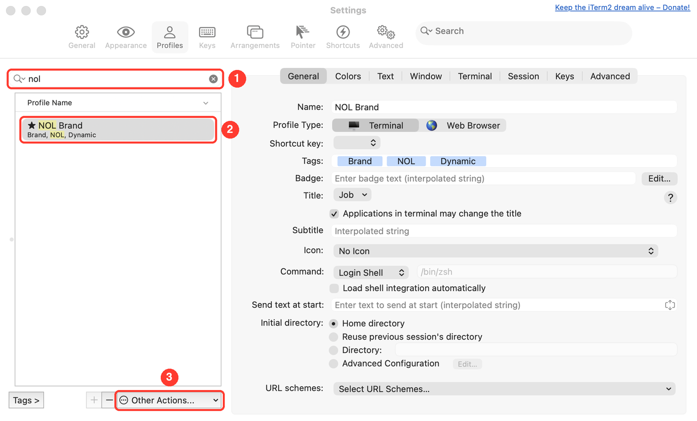

# 사용 안내

설치 방법별 절차, 회사 고르기, 자동 제안 설정, 알려진 제약을 모았습니다. 소개와 지원 테마 목록은 [README](../README.md)에 있습니다.

## 설치

전제 조건: **zsh + [powerlevel10k](https://github.com/romkatv/powerlevel10k) + iTerm2**.

[zsh-autosuggestions](https://github.com/zsh-users/zsh-autosuggestions)처럼 받아서 source 하면 끝인
zsh 플러그인입니다. 로고 폰트와 iTerm2 프로필은 플러그인이 셸을 열 때 설치하고, 업데이트로 파일이
바뀌면 다음 셸에서 다시 복사합니다. 생성물이 저장소에 커밋돼 있어 Rust·Python 같은 빌드 도구는
필요 없습니다 — Rust는 테마를 다시 만들 때([회사 추가](development.md#회사-추가))만 씁니다.

- [Oh My Zsh](#oh-my-zsh)
- [zinit](#zinit)
- [Antigen](#antigen)
- [직접 받기 (git clone)](#직접-받기-git-clone)

`~/.zshrc` 안에서의 순서는 상관없습니다 — `~/.p10k.zsh`보다 먼저 불러와도 됩니다. 자동 제안이
들어 있으므로 **zsh-autosuggestions는 따로 쓰지 마세요** ([자동 제안](#자동-제안)).

### Oh My Zsh

1. `$ZSH_CUSTOM/plugins`(기본 `~/.oh-my-zsh/custom/plugins`)에 받습니다.

    ```sh
    git clone https://github.com/Gogumang/oh-my-terminal ${ZSH_CUSTOM:-~/.oh-my-zsh/custom}/plugins/oh-my-terminal
    ```

2. `~/.zshrc`의 플러그인 목록에 넣습니다.

    ```sh
    plugins=(
        # 다른 플러그인...
        oh-my-terminal
    )
    ```

3. 새 터미널을 엽니다.

### zinit

1. `~/.zshrc`에 넣습니다.

    ```sh
    zinit light Gogumang/oh-my-terminal
    ```

2. 새 터미널을 엽니다.

### Antigen

1. `~/.zshrc`에 넣습니다.

    ```sh
    antigen bundle Gogumang/oh-my-terminal
    ```

2. 새 터미널을 엽니다.

### 직접 받기 (git clone)

1. 원하는 곳에 받습니다. 여기서는 `~/.zsh/oh-my-terminal`로 가정합니다.

    ```sh
    git clone https://github.com/Gogumang/oh-my-terminal ~/.zsh/oh-my-terminal
    ```

2. `~/.zshrc`에 넣습니다.

    ```sh
    source ~/.zsh/oh-my-terminal/oh-my-terminal.zsh
    ```

3. 새 터미널을 엽니다.

받은 폴더에서 `./install.sh`를 실행하면 2번을 대신 해 주고 폰트·프로필도 바로 설치합니다. 예전
설치가 `~/.zshrc`에 넣은 `brands.zsh` 줄은 이 줄로 바꿉니다 (백업을 남깁니다).

### 업데이트

플러그인을 갱신한 뒤 새 창을 열면 됩니다 — 바뀐 폰트·프로필은 그 셸이 복사합니다.

| 설치 방법 | 갱신 |
|---|---|
| Oh My Zsh, 직접 받기 | `git -C <받은 폴더> pull` (`omz update`는 플러그인을 갱신하지 않습니다) |
| zinit | `zinit update Gogumang/oh-my-terminal` |
| Antigen | `antigen update` |

## 회사 고르기

설정은 iTerm2 프로필 하나입니다. 폴더를 만들거나 명령을 칠 필요가 없고, iTerm2를 재시작할
필요도 없습니다.

1. **iTerm2 → Settings(⌘,) → Profiles**에서 `<회사> Brand` 프로필(예: `NOL Brand`)을 고르고
   **Other Actions… → Set as Default**. 이름 앞에 ★가 붙으면 기본 프로필입니다.
2. 새 창·탭부터 어느 폴더에서나 그 회사 테마가 나옵니다.



- **설치만 하고 기본 프로필이 `Default`로 남아 있으면 아무것도 바뀌지 않습니다.** 테마가 안
  나오는 창에서 `echo $ITERM_PROFILE`이 `<회사> Brand`인지 확인하세요.
- 회사를 바꾸려면 기본 프로필만 다른 `<회사> Brand`로 바꾸면 됩니다.
- 한 창에서만 써 보려면 ⌘O로 그 프로필 창을 여세요.
- 브랜드 프로필이 아닌 창에서는 프롬프트를 전혀 건드리지 않습니다.
- 업데이트해도 열려 있는 iTerm2가 새 폰트를 바로 읽습니다. 이미 열린 창에서는 `exec zsh`로
  셸을 다시 띄우면 새 프롬프트 설정까지 반영됩니다.

## 자동 제안

명령을 치면 그 글자로 시작하는 가장 최근 히스토리 항목의 나머지가 커서 뒤에 흐리게 나옵니다.
[zsh-autosuggestions](https://github.com/zsh-users/zsh-autosuggestions) v0.7.1을 분석해 옮긴
기능이라 따로 설치할 것이 없고, 회사 프로필과 상관없이 모든 대화형 셸에서 켜집니다.

| 키 | 동작 |
|---|---|
| → / End | 커서가 줄 끝이면 제안 전체를 받아들입니다 |
| Alt+F (`forward-word`) | 다음 단어 앞까지만 받아들입니다 |
| Enter | 친 것만 실행합니다 — 제안은 붙지 않습니다 |

iTerm2에서 Alt 조합을 쓰려면 **Profiles → Keys → Left Option key**를 `Esc+`로 바꾸세요. 기본값에서는
Option+F가 특수 문자(ƒ)를 입력합니다.

### 설정

`~/.zshrc`에서 정합니다. 기본값은 비어 있을 때만 채우므로 불러오기 전후 어디에 적어도 됩니다.

| 변수 | 기본값 | 뜻 |
|---|---|---|
| `OH_MY_TERMINAL_SUGGEST` | `1` | `0`이면 자동 제안을 켜지 않습니다 (불러오기 전에 정할 것) |
| `OH_MY_TERMINAL_SUGGEST_STYLE` | `fg=8` | 제안 글자 모양. `region_highlight` 형식 (예: `fg=#8a8a8a,underline`) |
| `OH_MY_TERMINAL_SUGGEST_STRATEGY` | `(history)` | 제안 찾는 방법. 앞에서부터 시도합니다 — `history`, `match_prev_cmd`, `completion` |
| `OH_MY_TERMINAL_SUGGEST_ASYNC` | `1` | `0`이면 자식 프로세스 없이 입력 중에 바로 찾습니다 |
| `OH_MY_TERMINAL_SUGGEST_BUFFER_MAX_SIZE` | 없음 | 이보다 긴 버퍼는 찾지 않습니다 (긴 붙여넣기 대비로 20 정도) |
| `OH_MY_TERMINAL_SUGGEST_HISTORY_IGNORE` | 없음 | 제안하지 않을 히스토리 패턴 (예: `'cd *'`) |
| `OH_MY_TERMINAL_SUGGEST_COMPLETION_IGNORE` | 없음 | `completion` 전략을 쓰지 않을 버퍼 패턴 (예: `'git *'`) |
| `OH_MY_TERMINAL_SUGGEST_{CLEAR,ACCEPT,EXECUTE,PARTIAL_ACCEPT,IGNORE}_WIDGETS` | `autosuggest.zsh` 참고 | 위젯별 동작. 실행 중에 바꾸면 다음 줄부터 반영됩니다 |

전략:

- `history` — 친 글자로 시작하는 가장 최근 항목.
- `match_prev_cmd` — 같은 조건에서, 방금 실행한 명령 다음에 쳤던 항목을 먼저 고릅니다.
  `HIST_IGNORE_ALL_DUPS`처럼 히스토리 순서를 바꾸는 옵션과는 맞지 않습니다.
- `completion` — 탭 완성이 처음 내놓는 결과. `compinit`이 필요합니다.

`bindkey`로 쓸 수 있는 위젯: `omt-suggest-accept`, `omt-suggest-execute`(받아들이고 실행),
`omt-suggest-clear`, `omt-suggest-fetch`, `omt-suggest-enable`, `omt-suggest-disable`,
`omt-suggest-toggle`.

```sh
bindkey '^ ' omt-suggest-accept     # Ctrl+Space로 받아들이기
```

## 예전 설치에서 옮길 때

플러그인 구조 이전에는 `~/.zshrc`에서 `brands.zsh`를 직접 source 하고, 폴더 경로로 회사를 골랐습니다.

- `install.sh`는 **같은 폴더**의 `brands.zsh` 줄만 진입점으로 바꿉니다. 다른 폴더에 받아 두었던 예전
  사본을 source 하는 줄은 남아 테마가 두 번 불리므로 직접 지우세요.

    ```sh
    grep -n 'brands.zsh' ~/.zshrc
    ```

- 폴더 경로(`~/Desktop/<회사>`)로는 더 이상 회사를 고르지 않습니다. [회사 고르기](#회사-고르기)처럼
  iTerm2 프로필을 고르세요.

## 제거

1. `~/.zshrc`에서 oh-my-terminal 줄(또는 플러그인 관리자 항목)을 지웁니다.
2. 플러그인이 설치한 폰트와 프로필을 지웁니다.

    ```sh
    rm ~/Library/Fonts/OhMyTerminalBrand*.ttf
    rm ~/Library/Application\ Support/iTerm2/DynamicProfiles/brand-themes.json
    ```

## 알려진 제약

- **열린 탭의 프로필을 바꾸면 프롬프트는 그대로입니다.** `ITERM_PROFILE`은 세션을 열 때
  정해지므로, 프로필을 바꾼 뒤에는 새 탭·창을 여세요.
- **`ITERM_PROFILE`이 전달되지 않는 셸에서는 테마가 나오지 않습니다.** 다른 터미널 앱이나
  ssh로 접속한 원격 셸이 그렇습니다. 자동 제안은 그런 셸에서도 켜집니다.
- **zsh-autosuggestions와 함께 쓰지 마세요.** zsh-autosuggestions가 먼저 불리면 oh-my-terminal의
  자동 제안은 켜지지 않습니다.
- **자동 제안은 zsh 5.4 이상에서만 켜집니다.** 입력이 밀려 있는지 알 수 있는 버전부터라, 그 전에는
  붙여넣는 글자마다 제안을 찾게 됩니다. macOS 기본 zsh는 5.9입니다.
- **플러그인을 지워도 설치된 폰트와 프로필은 남습니다.** [제거](#제거)의 2번처럼 직접 지우세요.
- **로고는 한 가지 색 실루엣입니다.** 원본의 여러 색은 쓰지 않습니다 — 컬러 비트맵 글리프는
  iTerm2 GPU 렌더러에서 크기와 위치가 틀어지므로 외곽선만 씁니다.
- **작게 봐도 알아볼 마크를 공식 출처에서 못 찾은 로고가 몇 개 있습니다.** 쿠팡(톱니 배지 속
  글자), beusable, gogoro, headspace, kakaogames, openpoint는 여전히 약합니다.
- **브랜드 프로필에서 한글은 시스템 폰트로 표시됩니다.** MesloLGS NF에 한글이 없어서이며,
  p10k 기본 설정(MesloLGS NF)을 쓸 때와 같습니다.
- **배경 워터마크와 탭 아이콘은 넣지 않습니다.** 두 키가 로고 PNG의 절대경로를 요구하는데
  그 경로는 빌드한 머신에만 존재해, 산출물을 커밋해 배포하는 구조와 맞지 않습니다.
  로고는 프롬프트 글리프로 보여줍니다.
- **브랜드 프로필에서는 p10k의 경로 축약(`truncate_to_unique` 등)이 적용되지 않습니다.**
  프롬프트가 p10k의 축약 결과를 되받으면 색이 이중으로 입혀져 깨지기 때문에 `%~`로
  직접 만듭니다. 깊은 경로에서 프롬프트가 길어질 수 있습니다.
